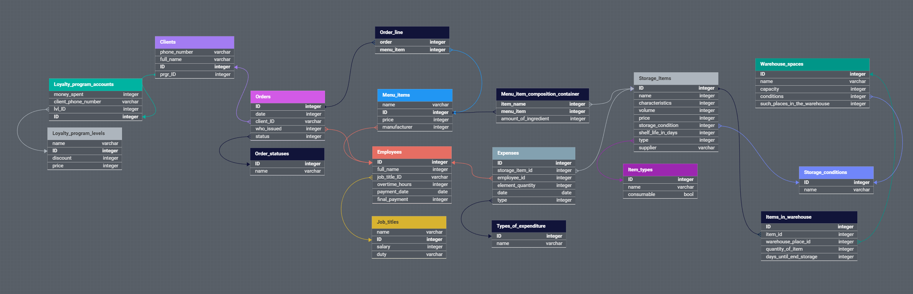
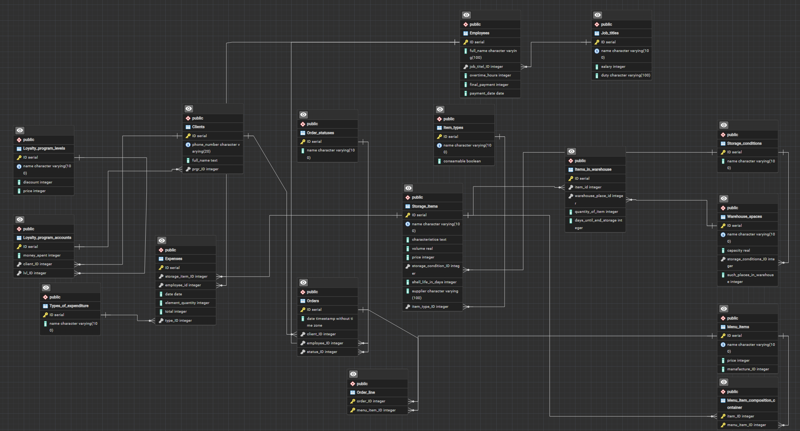

Матвее С.А. 
Прин-268 
Тема: "Бар"

er - диаграмма:

схема риляционной БД

сгенерированная схема

**_Сама бд должна_**
1. Вставлять данные в таблицы.
2. Обновлять программу лояльности для клиентов, при оформлении заказа(количество потраченных денег и уровень программы лояльности) (триггер - before_update_orders).
3. Обновлять количество расходников на складе, которые участвуют в создании пунктов меню, при оформлении заказа (триггер - decrease_items_in_warehouse).
4. Удалять просроченные продукты (процедура - remove_expired_products).
5. Выдавать список просроченных продуктов (функция - get_list_expired_products).
6. Выдавать список не просроченных продуктов (функция - get_list_not_expired_products).
7. Обновлять зарплату работнику, при добавлении переработки (триггер - after_updating_employee_overtime).
8. Обновлять зарплату работнику, при выплате зарплаты (триггер - after_updating_employee_payment_date).
9. Обновлять зарплату работнику, при смене должности (триггер - after_updating_employee_job_title).
10. Выдавать расходы, доходы и прибыль за заданный период (функции - get_expenses, get_income, get_attendance)
11. Выдавать доход за определенный период при изменении цены предметов, участвующих в создании пунктов меню (функция - get_income_when_price_items_warehouse_changes).
12. Выдавать доход за определенный период при изменении цены пунктов меню (функция - get_income_when_menu_prices_change).
13. Выдавать возможно ли положить предмет на склад (функция - is_possibly_put_in_storage)
14. Класть вещи на склад (процедура - insert_in_warehouse)
15. Вставлять траты на предметы (процедура - insert_in_expenses)

ссылка на схему БД - https://dbdesigner.page.link/Qvj38AK5vNeJn7Sa7